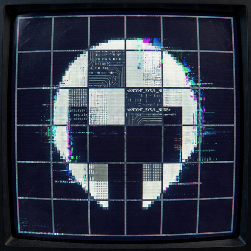

<div align="center">

```
 ██╗  ██╗ ██████╗ ██████╗
 ██║ ██╔╝██╔════╝██╔════╝
 █████╔╝ ██║     ██║
 ██╔═██╗ ██║     ██║
 ██║  ██╗╚██████╗╚██████╗
 ╚═╝  ╚═╝ ╚═════╝ ╚═════╝
```

# knightscomputer.club

**nodo público · foro · // nexo · tecnoactivismo**



<br/>

[](https://www.knightscomputer.club)
[](https://github.com/navywakura/knightscomputerclub/releases)
[](#licencia--uso)
[](https://github.com/navywakura/knightscomputerclub/pulls)
[](#seguridad--auditoría_pública)

```
// CRT scanlines · verde terminal · underground 2000
// no somos una startup. somos un club.
```

</div>

---

## qué es esto

**knightscomputer.club** es la web del club: landing, foro estilo imageboard/foro clásico, chat casi en vivo (**// nexo**), DMs con PIN, paste ZK, donaciones y clientes (Electron + CLI).

Todo corre sobre **Next.js 15** + **Neon Postgres** + **Vercel**.  
La estética es a propósito: CRT, monoespaciado, paneles 2000, sin UI corporativa.

| módulo | path | nota |
|--------|------|------|
| landing | `/` | manifesto / lobby |
| foro | `/forum` | boards + hilos + markdown |
| nexo | `/nexo` | tablones chat (crear board = VIP) |
| paste | `/paste` | pastebin cifrado en el cliente |
| descargas | `/descargar` | Electron Windows + kcc-cli |
| admin | `/admin` | solo owner (ban, VIP, mails) |

**sitio en vivo →** [www.knightscomputer.club](https://www.knightscomputer.club)

---

## por qué el repo es público

Queremos que la gente **lea el código**, proponga parches y **mejore la seguridad a la luz del día**.

```
código cerrado ≠ más seguro
código abierto + ojos = menos lugares donde esconder basura
```

Si encontrás un bug de seguridad: abrí un **issue** con etiqueta `security` o un **PR** con el fix (sin PoC destructivo).  
Si es algo grave (RCE, dump de sesión, bypass de ban masivo), podés escribir primero al owner del repo y después lo hacemos público con el parche.

> **No subas secretos.** Nunca. Ni en issues, ni en PRs, ni en screenshots de `.env`.

---

## stack

```
┌──────────────┬─────────────────────────────────────┐
│ capa         │ tech                                │
├──────────────┼─────────────────────────────────────┤
│ frontend     │ Next.js 15 App Router · React 19    │
│ validación   │ Zod en APIs de escritura            │
│ auth         │ JWT httpOnly · bcrypt · OAuth opt.  │
│ db           │ Neon serverless Postgres            │
│ media        │ BYTEA en DB + check NSFW (Gemini)   │
│ host         │ Vercel (+ mirrors opcionales)       │
│ desktop      │ Electron + electron-updater         │
│ cli          │ packages/kcc-cli (Node ≥18)         │
└──────────────┴─────────────────────────────────────┘
```

---

## quickstart (local)

```bash
git clone https://github.com/navywakura/knightscomputerclub.git
cd knightscomputerclub

cp .env.example .env.local
# editá como mínimo:
#   DATABASE_URL   → Neon
#   JWT_SECRET     → openssl rand -base64 32
#   ADMIN_SECRET   → openssl rand -base64 24

npm install
npm run db:setup    # tablas + categorías seed
npm run dev         # http://localhost:3000
```

<details>
<summary><b>variables de entorno (resumen)</b></summary>

| var | uso |
|-----|-----|
| `DATABASE_URL` | Postgres Neon |
| `JWT_SECRET` | firma de sesión (≥16, random) |
| `ADMIN_SECRET` | VIP por API / ops |
| `CAPTCHA_SECRET` | captcha anti-bot (fallback JWT) |
| `GEMINI_API_KEY` | moderación NSFW de imágenes (gratis) |
| `GIPHY_API_KEY` | GIFs en nexo |
| `GOOGLE_*` / `GITHUB_*` | OAuth opcional |
| `NEXT_PUBLIC_SITE_URL` | canónica (`https://www.knightscomputer.club`) |
| `NEXT_PUBLIC_*` donaciones | PayPal, Ko-fi, BTC, SOL, USDT |

Lista completa y comentarios: [`.env.example`](.env.example)

</details>

<details>
<summary><b>CLI kcc</b></summary>

```bash
# desde monorepo
npm run kcc
# o
cd packages/kcc-cli && npm link

# desde release GitHub
# https://github.com/navywakura/knightscomputerclub/releases
npm i -g ./kcc-cli-1.3.0.tgz
kcc login <user> <pass>
kcc boards
```

</details>

<details>
<summary><b>release Electron + CLI (maintainers)</b></summary>

```bash
# GH_TOKEN en .env.local (no commitear)
npm run release          # minor 1.3.0 → 1.4.0
npm run release -- 1.5.0
npm run release:dry      # simula

# docs/release.md
```

</details>

---

## mapa del repo

```
.
├── src/app/              # rutas Next (forum, nexo, api, admin…)
├── src/components/       # UI (ForumApp, NexoApp, AdminPanel…)
├── src/lib/              # auth, db, validate, nexo, nsfw…
├── packages/
│   ├── kcc-cli/          # shell de terminal para // nexo
│   └── web-notify/       # kit de notificaciones portable
├── scripts/
│   ├── release.mjs       # bump + build + GitHub Release
│   └── setup-db.mjs
├── docs/                 # release, electron, security, mirrors
├── electron/             # shell desktop (local / .gitignore)
├── versions.json         # verdad de versión Electron/CLI ↔ /descargar
└── public/               # assets estáticos
```

---

## boards del foro (seed)

```
// general · // rxos-dev · // debate · // ops-infra · // news
// offtopic → random, memes, anime, ciencia → física/bio/espacio…
// misterio → esoterismo, ufología, aliens, paranormal,
              awakening, religion, espiritualidad, conspiracion, folklore
// hobby → dibujos, cocina, musica
// nexo  → hub; los boards de chat VIP aparecen acá solos
```

Al crear un tablón en **/nexo** (VIP) se espeja una categoría bajo `// nexo` en el foro.

---

## seguridad · auditoría pública

Ya hay capas base. **No alcanza**: queremos PRs.

### lo que ya está (baseline)

- passwords **bcrypt** (cost alto)
- sesión **JWT** en cookie `httpOnly` + `SameSite` + `secure` en prod
- **Zod** en rutas de escritura
- **CSP** sin `unsafe-eval`
- rate-limit en middleware (auth, APIs calientes)
- captcha en creación sensible
- verify de email + opción admin de forzar verify
- moderación de media (NSFW fail-open/closed configurable)
- soft-delete / ban / reports

### lo que nos interesa que aportes

```diff
+ rate-limits más finos / por IP+user
+ auditoría de IDsOR y ownership en cada DELETE/PATCH
+ hardening CSP / headers (COOP, CORP, Trusted Types si cabe)
+ tests de auth (sesión robada, cookie flags, CSRF en mutaciones)
+ review de uploads y path traversal en media
+ threat model corto en docs/
+ fuzz de parsers markdown / paste ZK
- “reescribir todo en otro framework”
- “agregar dark pattern de tracking”
```

### cómo reportar

1. **Issue** con título `[security] …` y pasos mínimos (sin dumps reales de prod).
2. **PR** con fix + nota de impacto.
3. Si es crítico y explotable en prod: contactá al owner y coordinamos disclosure.

### reglas del playground

| ok | no ok |
|----|--------|
| leer código, proponer parches | atacar el sitio en prod “por diversión” |
| PoC en local / staging | DoS, spam, robo de cuentas reales |
| issues públicos de diseño | pegar `DATABASE_URL` / JWT / mails de terceros |

Leé también [`docs/security-hardening.md`](docs/security-hardening.md) si existe en el branch.

---

## contribuir (features no-security)

1. Fork → branch `feat/…` o `fix/…`
2. `npm run dev` + cambios chicos y legibles
3. Sin secrets en el diff
4. PR en español o inglés; describí **qué** y **por qué**
5. Mantener la estética del club (no Material / no Bootstrap corporativo)

```bash
# checklist mental antes del PR
npm run build     # que compile
# no rompas /forum ni /nexo sin avisar
```

---

## clientes

| cliente | estado | dónde |
|---------|--------|--------|
| Web | ready | [knightscomputer.club](https://www.knightscomputer.club) |
| Windows Electron | ready · auto-update | [Releases](https://github.com/navywakura/knightscomputerclub/releases) · [/descargar](https://www.knightscomputer.club/descargar) |
| kcc-cli | ready | asset `kcc-cli-*.tgz` en el release |
| macOS / Linux / móvil | soon | PRs de packaging bienvenidos |

Versión publicada actual: ver badge **release** arriba o `versions.json`.

---

## deploy

1. Importá el repo en Vercel (root = monorepo tal cual).
2. Variables de entorno = `.env.example` (valores reales, nunca en git).
3. Deploy. `ensureSchema()` crea/actualiza tablas en el primer request útil.

Mirrors / OpenBSD: [`docs/deploy-mirrors.md`](docs/deploy-mirrors.md)

---

## licencia · uso

Código del club para **estudiar, auditar y mejorar**.  
Marca, logo y dominio **knightscomputer.club** son del proyecto.

- Usá el código para aprender y proponer PRs.
- Si montás un fork en producción, cambiá secretos, branding y no te hagas pasar por el nodo oficial.
- Donaciones al nodo oficial: [/donate](https://www.knightscomputer.club/donate)

---

<div align="center">

```
┌─────────────────────────────────────────┐
│  knightscomputer.club                   │
│  open code · better locks · no cults    │
│                                         │
│  [ foro ]  [ nexo ]  [ donate ]         │
└─────────────────────────────────────────┘
         ↑  stars y PRs alimentan el nodo
```

**owner / ops:** [@navywakura](https://github.com/navywakura)

`EOF // gracias por mirar bajo el capó`

</div>
